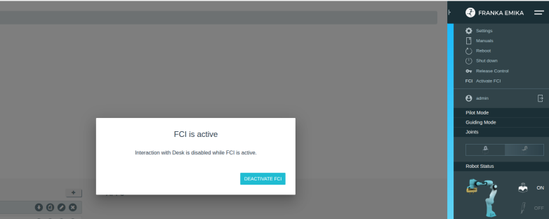

# 预配置

## Panda机械臂配置

1. 设置实时内核 https://www.franka.cn/FCI/installation_linux.html

1. 设置英伟达补丁

   
   
1. 安装底层驱动0.9.2， 得安装到系统底层，否则编译ros包还要手动给定libfranka的路径

   ```bash
   git clone --recursive --branch 0.9.2  https://github.com/frankarobotics/libfranka.git
   cd libfranka/
   cmake .. -DCMAKE_BUILD_TYPE=Release -DCMAKE_INSTALL_PREFIX=/usr/local
   make -j$(nproc)
   sudo make install  
   # 检查是否成功
   ls /usr/local/lib | grep franka 
   ```

   

2. 网页激活FCI

   

3. panda机械臂测试

   ```bash
   # 测试panda延迟
   sudo ping 192.168.5.245 -i 0.001 -D -c 10000 -s 1200
   # 测试panda状态通讯
   cd /libfranka/build/examples
   ./echo_robot_state  192.168.5.245
   ```

   

# ROS配置

1. 安装前置包

   ```bash
   # 速度控制器
   sudo apt install ros-noetic-velocity-controllers
   ```

   

2. 安装ROS相关包

   ```bash
   cd ~/
   git clone git@github.com:RAI-ZZU/catkin_robo_arm_ws.git
   cd catkin_robo_arm_ws/
   catkin build   --cmake-args -DCMAKE_BUILD_TYPE=Release 
   source ~/catkin_robo_arm_ws/devel/setup.bash
   ```

3. 向`~/bashrc` 添加source 路径

   ```bash
   source /opt/ros/noetic/setup.bash
   source ~/catkin_ws/devel/setup.bash
   source ~/catkin_robo_arm_ws/devel/setup.bash
   ```

## Panda ROS测试

1. 返回初始位置

   ```bash
   roslaunch franka_example_controllers  move_to_start.launch robot_ip:=192.168.5.245
   ```

2. moveit拖拽运动测试

   ```bash
   roslaunch panda_moveit_config  franka_control.launch robot_ip:=192.168.5.245
   ```

3. 伺服模式测试

   ```bash
   # 返回初始位置
   roslaunch franka_example_controllers  move_to_start.launch robot_ip:=192.168.5.245
   # 执行demo
   roslaunch moveit_servo panda_servo_system.launch
   ```

   


## Panda 末端位姿伺服使用

1. 启动末端位姿追踪伺服

   ```bash
   roslaunch moveit_servo  panda_pose_tracker_node.launch 
   ```

2. 向话题`/panda_pose_tracker_node/target_pose` 发送`PoseStamped` 格式数据，默认要求发送的位姿是相对于`panda_link0`坐标系的，或者选择合适的tf变换

   ```python
       # 发送的例子
       def servo_to_pose(self, position: list, orientation: list, frame_id="panda_link0"):
               """
               向 C++ Pose Tracker 发送目标位姿，进行连续跟随控制。
               
               :param position: [x, y, z] 目标位置
               :param orientation: [qx, qy, qz, qw] 目标四元数姿态
               :param frame_id: 参考坐标系，默认相对于基座 (panda_link0)
               """
               if len(position) != 3 or len(orientation) != 4:
                   rospy.logerr("位置必须是 3维，姿态必须是 4维四元数")
                   return
   
               # 构造 PoseStamped 消息
               target_pose = PoseStamped()
               
               # 赋予时间戳和参考坐标系 (极其重要)
               target_pose.header.stamp = rospy.Time.now()
               target_pose.header.frame_id = frame_id
               
               # 填入 XYZ
               target_pose.pose.position.x = position[0]
               target_pose.pose.position.y = position[1]
               target_pose.pose.position.z = position[2]
               
               # 填入四元数
               target_pose.pose.orientation.x = orientation[0]
               target_pose.pose.orientation.y = orientation[1]
               target_pose.pose.orientation.z = orientation[2]
               target_pose.pose.orientation.w = orientation[3]
   
               # 发布出去！底层的 C++ 节点收到后会立刻开始解算并伺服过去
               self.pose_tracker_pub.publish(target_pose)
   
   ```

   使用realsensed435相机
   ```bash
   sudo apt-get update
   sudo apt-get install ros-noetic-ddynamic-reconfigure
   sudo apt-get install ros-$ROS_DISTRO-realsense2-camera
   ```
   使用，启动相机节点，这是基于ros的话题方式
   ```bash
   roslaunch realsense2_camera rs_camera.launch
   ```
   可以更加简洁一些，直接使用python api而不用ros话题（但是最好体现安装刚才的`ros-$ROS_DISTRO-realsense2-camera`）
   ```bash
   pip3 install pyrealsense2
   ```


## VX300s 机械臂安装
### 安装
```bash
cd ~/catkin_robo_arm_ws/src/vx300s/interbotix_ros_core/interbotix_xs_sdk
sudo cp 99-interbotix-udev.rules /etc/udev/rules.d/
sudo udevadm control --reload-rules && sudo udevadm trigger
```


### 测试

1. 虚拟

   ```bash
   roslaunch interbotix_xsarm_descriptions xsarm_description.launch robot_model:=vx300s use_joint_pub_gui:=true
   ```

   

2. 真机测试

   ```bash
   roslaunch interbotix_xsarm_control xsarm_control.launch robot_model:=vx300s use_joint_pub_gui:=true
   ```

   
   
3. 使用moveit控制真机

   ```bash
   roslaunch interbotix_xsarm_moveit xsarm_moveit.launch robot_model:=vx300s use_actual:=true  dof:=7
   ```

4. 使用改动版的主动观测臂
   ```bash
   roslaunch vx300s_7dof_description xsarm_control.launch 
   ``` 
   

